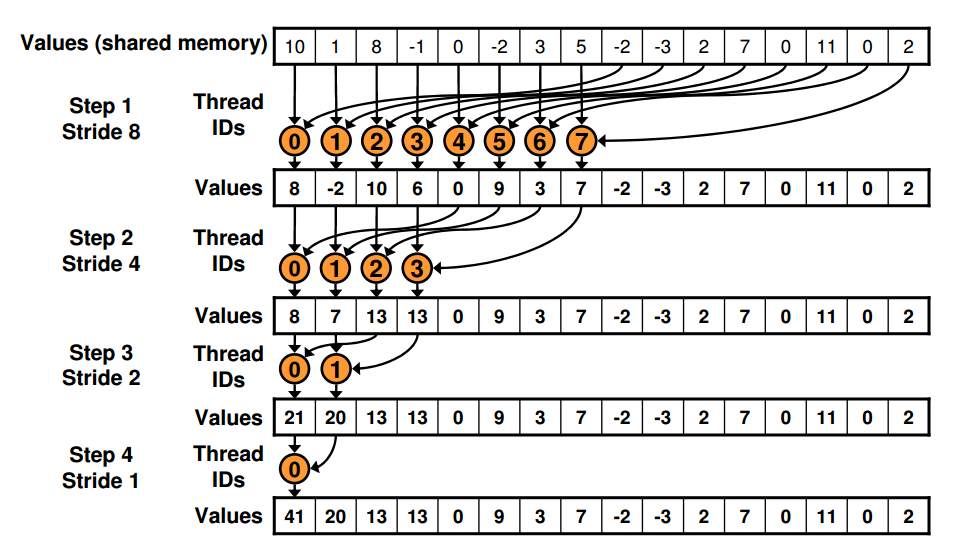
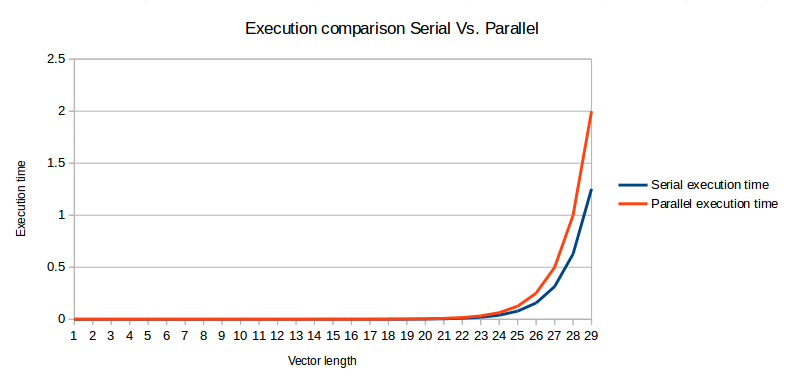

<h1>Sum Reduction Algorithm in CUDA C</h1>
<h2>overview</h2>

This is a simple implementation of the sum reduction algorithm using the <strong>Reduction #3: Secuential addressing</strong> explained in <a href="http://developer.download.nvidia.com/compute/cuda/1.1-Beta/x86_website/projects/reduction/doc/reduction.pdf">Optimizing Parallel Reduction &#8211; Mark Harris</a> wich offers us an implementation without secuential addressing conflicts, in addition we don&#8217;t have shared memory bank conflicts or highly divergent branching results.

<del>I tried to implement the Reduction #4 but some problems appeared calling the kernel</del>

<h3>Computer specs</h3>

&#8594; CPU 

<ul>
	<li>processor       : 1</li>
	<li>vendor_id       : GenuineIntel</li>
	<li>cpu family      : 6</li>
	<li>model           : 58</li>
	<li>model name      : Intel&#174; Core&#8482; i7-3770K CPU @ 3.50GHz</li>
	<li>stepping        : 9</li>
	<li>cpu MHz         : 1600.000</li>
	<li>cache size      : 8192 KB</li>
	<li>cpu cores       : 4</li>
</ul>

&#8594; GPU 

<ul>
	<li>Tesla K40c: 3.5</li>
	<li>Global memory:   11519mb</li>
	<li>Shared memory:   48kb</li>
	<li>Constant memory: 64kb</li>
	<li>Block registers: 65536</li>
	<li>Warp size:         32</li>
	<li>Threads per block: 1024</li>
	<li>Max block dimensions: [ 1024, 1024, 64 ]</li>
	<li>Max grid dimensions:  [ 2147483647, 65535, 65535 ]</li>
</ul>
<h2>Execution 
(How it works)</h2>

According to the presentation this isn&#8217;t the best way to approach this problem because in the first iteration half of the threads are idle but the <strong>Reduction #3</strong> is easier to understand and accomplishes all the requirements of this course.

<h2>Results</h2>

